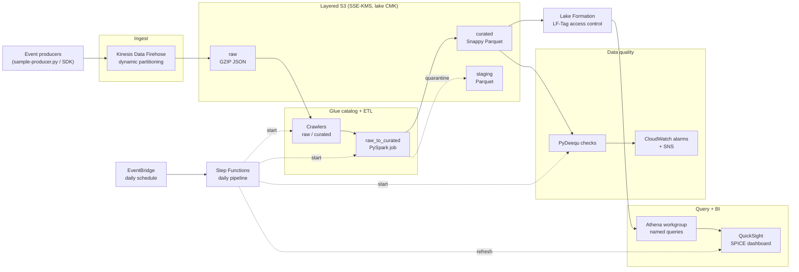

# aws-data-lakehouse

An end-to-end, Terraform-managed **data lakehouse on AWS**: streaming ingest →
layered object storage → cataloging and ETL → governed query → BI, with an
automated data-quality gate and a daily orchestration pipeline.

The lakehouse pattern keeps the low cost and openness of a data lake (object
storage, open file formats, schema-on-read) while adding the governance and
query ergonomics of a warehouse (central catalog, fine-grained access control,
analytics-ready curated tables). Every layer here is reusable Terraform, so a
team can stand up a governed analytics platform from scratch.

## Architecture



Producers publish JSON events to Firehose, which partitions them by
`event_type` and ingestion date and lands them GZIP-compressed in the **raw**
bucket. A Glue crawler registers new partitions; the **raw_to_curated** PySpark
job enforces schema, quarantines bad records, de-duplicates by `event_id`, and
writes analytics-ready **curated** Parquet. Lake Formation governs catalog
access with LF-Tags (including column-level masking of confidential fields);
Athena and QuickSight read the curated layer. A PyDeequ job continuously
asserts data-quality constraints and raises CloudWatch alarms on violations.
A Step Functions state machine, triggered daily by EventBridge, sequences the
whole flow: crawler → curated ETL → quality gate → dashboard refresh.

## Layered storage model

| Layer    | Bucket suffix | Format                       | Purpose                                              |
|----------|---------------|------------------------------|------------------------------------------------------|
| Raw      | `-raw`        | Source-fidelity JSON (GZIP)  | Immutable landing zone; exactly what producers sent  |
| Staging  | `-staging`    | Parquet                      | Cleansed/quarantine intermediate + job scratch       |
| Curated  | `-curated`    | Parquet (SNAPPY)             | Analytics-ready, partitioned, catalogued tables      |

Raw objects are partitioned on write by `event_type` and ingestion date
(`year/month/day`) so crawlers and queries prune aggressively. All three
buckets enforce `BucketOwnerEnforced`, full public-access blocking, versioning,
SSE-KMS with the lake CMK, and server-access logging; the raw layer tiers to
Infrequent Access at 30 days, Glacier at 90, and expires at 365.

## Module reference

| Module                      | Responsibility                                                                                  |
|-----------------------------|-------------------------------------------------------------------------------------------------|
| `terraform/storage`         | Lake CMK (rotation on) + layered raw/staging/curated buckets, lifecycle, access logging          |
| `terraform/ingest`          | Kinesis Firehose delivery stream, dynamic partitioning, least-privilege role, sample producer    |
| `terraform/catalog`         | Glue databases (raw/staging/curated), tables, crawlers, raw→curated PySpark ETL, Lake Formation   |
| `terraform/query`           | Athena workgroup (KMS results, metrics, scan cap) + named analytics queries over curated          |
| `terraform/viz`             | QuickSight Athena data source, SPICE dataset, executive dashboard (opt-in)                         |
| `terraform/quality`         | PyDeequ data-quality Glue job + CloudWatch alarms + SNS alerts                                    |
| `terraform/orchestration`   | Step Functions daily pipeline + EventBridge schedule + failure notifications                      |

Each Terraform directory is a self-contained module composed by the root
configuration in `terraform/`. PySpark job scripts live in `glue-scripts/`.

## Quick start

```bash
git clone https://github.com/shivajichaprana/aws-data-lakehouse.git
cd aws-data-lakehouse/terraform

terraform init
terraform plan  -var 'project=lakehouse' -var 'environment=dev'
terraform apply -var 'project=lakehouse' -var 'environment=dev'
```

Or use the Makefile from the repo root:

```bash
make init
make plan ENV=dev
make apply ENV=dev
```

Publish a few sample events once the stream exists, then run the pipeline:

```bash
make seed COUNT=500           # publish sample events via the producer
make run-pipeline             # start one Step Functions execution now
```

QuickSight is **off by default** (it needs an account subscription). Enable it
by passing `-var 'enable_quicksight=true'` and a
`-var 'quicksight_principal_arn=...'`; the dashboard refresh step joins the
daily pipeline automatically once a dataset exists.

## Configuration highlights

| Variable                     | Default                | Purpose                                                       |
|------------------------------|------------------------|---------------------------------------------------------------|
| `project` / `environment`    | `lakehouse` / `dev`    | Name prefix and environment for every resource                 |
| `aws_region`                 | `us-east-1`            | Target region                                                  |
| `raw_lifecycle`              | 30 / 90 / 365 days     | Raw IA → Glacier → expiration schedule                         |
| `enforce_lf_tag_access`      | `true`                 | Drop the legacy `IAMAllowedPrincipals` super-grant             |
| `enable_quicksight`          | `false`                | Provision the QuickSight BI layer                              |
| `enable_pipeline_schedule`   | `true`                 | Create the daily EventBridge schedule for the pipeline         |
| `pipeline_schedule`          | `cron(0 4 * * ? *)`    | UTC cadence, sequenced after crawler/ETL/quality windows       |

See `terraform/variables.tf` for the complete, validated list.

## Documentation

- [docs/architecture.md](docs/architecture.md) — component-by-component design and data flow
- [docs/data-governance.md](docs/data-governance.md) — Lake Formation, LF-Tags, encryption, and column-level security
- [docs/cost-model.md](docs/cost-model.md) — cost drivers, an illustrative monthly estimate, and levers
- [CONTRIBUTING.md](CONTRIBUTING.md) — local checks and contribution workflow

## Requirements

- Terraform >= 1.5
- AWS provider >= 5.40
- An AWS account with permission to create Firehose, S3, KMS, IAM, Glue, Lake
  Formation, Athena, QuickSight, Step Functions, EventBridge, SNS, and
  CloudWatch resources
- Python 3.9+ with `boto3` for the sample producer

## Security

Please report security issues through a
[GitHub Security Advisory](https://github.com/shivajichaprana/aws-data-lakehouse/security/advisories/new)
rather than a public issue.

## License

Released under the [MIT License](LICENSE).
