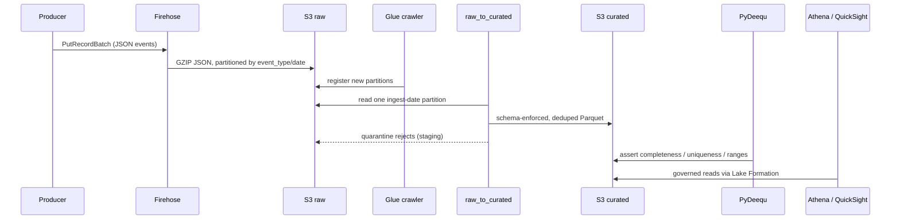

# Architecture

This document walks the lakehouse component by component, following data from
the moment a producer emits an event to the moment an analyst opens a
dashboard. The root module in `terraform/` composes seven child modules; each
section below maps to one of them.

## Data flow at a glance



## 1. Ingest (`terraform/ingest`)

A Kinesis Data Firehose delivery stream is the single front door. Events are
JSON of the shape `{ "event_type", "event_id", "ts", "payload": {...} }`.

- **Dynamic partitioning** extracts `event_type` via JQ metadata extraction and
  writes Hive-style prefixes `event_type=<t>/year=<y>/month=<m>/day=<d>/`, with a
  separate `error_output_prefix` for delivery failures.
- Records are line-delimited (an `AppendDelimiterToRecord` processor) and
  GZIP-compressed. Parquet-on-ingest is wired but **opt-in**
  (`enable_parquet_conversion`, default `false`); the canonical path keeps raw
  at source fidelity and lets the ETL job own the Parquet conversion.
- The Firehose role is least-privilege and carries an `sts:ExternalId`
  confused-deputy guard plus `kms:ViaService` scoping for the lake CMK.
- `terraform/ingest/sample-producer.py` publishes synthetic events in batches of
  up to 500 with per-record retry and full-jitter backoff.

## 2. Storage (`terraform/storage`)

One customer-managed KMS key (rotation enabled) encrypts the whole lake. Three
buckets — `raw`, `staging`, `curated` — are created via `for_each` and share a
hardened baseline: `BucketOwnerEnforced` ownership, full public-access
blocking, versioning, SSE-KMS with bucket keys, and server-access logging to a
dedicated log bucket. Lifecycle rules tier the raw layer (IA at 30 days,
Glacier at 90, expire at 365) and clean up noncurrent versions and aborted
multipart uploads; staging and curated keep housekeeping-only rules.

## 3. Catalog + ETL (`terraform/catalog`)

- **Databases:** `raw`, `staging`, `curated` Glue databases (name-sanitized).
- **Tables:** `raw_events` (OpenX JSON SerDe over the Firehose `events/` prefix,
  with `event_type/year/month/day` as partition keys) and `curated_events` (a
  typed Snappy-Parquet schema).
- **Crawlers:** raw and curated crawlers run in `CRAWL_NEW_FOLDERS_ONLY` mode
  with a LOG-only schema-change policy, so they register new partitions without
  ever rewriting the declared schema.
- **ETL job:** `glue-scripts/raw_to_curated.py` is a Glue 4.0 (G.1X) PySpark
  job. It reads a single ingest-date partition with a push-down predicate,
  enforces schema (records missing `event_id` or an unparseable timestamp are
  written to a quarantine prefix rather than dropped), flattens and type-casts
  the payload, de-duplicates by `event_id` keeping the latest `event_ts`, and
  writes to curated via a `glueparquet` sink with `enableUpdateCatalog`.
- A Glue security configuration encrypts catalog output, job bookmarks, and
  CloudWatch logs with the lake CMK.

## 4. Governance (`terraform/catalog/lake-formation.tf`)

Lake Formation is configured for tag-based access control. See
[data-governance.md](data-governance.md) for the full model; in short, two
LF-Tags (`layer` and `sensitivity`) drive grants, the legacy
`IAMAllowedPrincipals` super-grant is removed when `enforce_lf_tag_access` is
true, and the three bucket prefixes are registered as data locations.

## 5. Query (`terraform/query`)

An Athena workgroup enforces a KMS-encrypted result location, publishes
CloudWatch metrics, and can cap bytes scanned per query. Eight named queries
ship over the curated `events` table, each pruning on partition columns where
possible: daily event counts, revenue by date, top SKUs by quantity, top search
queries, daily active users, events by country, hourly event rate, and a
partition-freshness check.

## 6. BI (`terraform/viz`)

When `enable_quicksight` is set and a principal ARN is supplied, the module
provisions a QuickSight Athena data source (bound to the workgroup), a SPICE
dataset over curated `events` with a daily full refresh, and an executive
dashboard (event-count and total-value KPIs plus events-by-type and
daily-volume visuals). Every QuickSight resource is gated so a credential-less
plan stays empty.

## 7. Data quality (`terraform/quality`)

A PyDeequ Glue job (`glue-scripts/quality_checks.py`) reads curated Parquet
directly from S3 (hybrid access sidesteps Lake Formation grants for the
service role) and runs a `VerificationSuite`: completeness on
`event_id`/`event_ts`/`event_type`, uniqueness on `event_id`, non-negativity on
`value`/`quantity`, and optional membership and range checks. It emits
`ConstraintsFailed`, `ConstraintsTotal`, `CheckSuccess`, and `RowsVerified`
CloudWatch metrics and persists the full result set to S3. Three alarms (any
failed constraint, an overall failed check, and optional staleness) notify a
KMS-encrypted SNS topic.

## 8. Orchestration (`terraform/orchestration`)

A STANDARD Step Functions state machine sequences the daily run:

```
Initialize
  → StartRawCrawler → (Wait / GetCrawler poll loop until READY)
  → RunCuratedEtl   (glue:startJobRun.sync)
  → RunDataQuality  (glue:startJobRun.sync)
  → RefreshDashboard (quicksight:createIngestion — only when a dataset exists)
  → PipelineSucceeded
```

The crawler poll loop is bounded by `interval × attempts` with a
`CrawlerTimedOut` guard. Every stage routes failures to a single
`NotifyFailure → SNS publish → PipelineFailed` tail; transient
`ConcurrentRunsExceededException` / throttling errors retry, while real
failures fall through to the catch. EventBridge Scheduler triggers the machine
daily at `cron(0 4 * * ? *)` UTC, after the crawler, ETL, and quality windows.
The execution role is scoped to the specific crawler and job ARNs, SNS publish,
CloudWatch Logs delivery, and (conditionally) QuickSight ingestion and X-Ray.

## Design principles

- **Layered, immutable raw.** Producers' bytes are preserved; all cleansing
  happens downstream, so reprocessing is always possible.
- **Schema-on-write for curated.** The ETL job is the contract boundary; bad
  records are quarantined, never silently dropped.
- **Least privilege everywhere.** Per-component IAM roles, confused-deputy
  guards, and `kms:ViaService` scoping rather than broad wildcards.
- **Opt-in cost.** QuickSight, X-Ray, and schedules are flags so a baseline
  deployment stays minimal and a credential-less `plan` stays clean.
